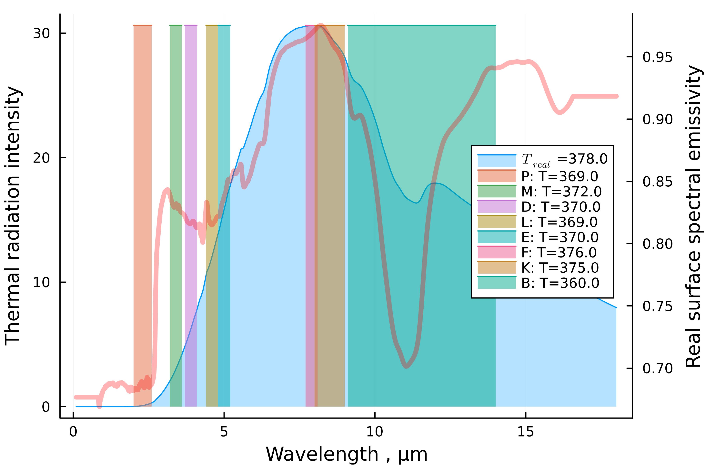

# RadiationPyrometers

The purpose of this small package is to create a virtual pyrometer that can be used to calculate the emissivity of a real-life pyrometer, enabling the measured temperature to be adjusted to match the actual temperature of the heated object. There are several 
default pyrometers with specified spectral ranges, see the following figure:

  

It is also possible to create self-configured pyrometer with user-specified spectral range
Notebook file with `ThermovisorData-test.jl` usage examples are available at [Pluto notebooks](https://github.com/Manarom/RadiationPyrometers.jl/blob/main/notebooks).